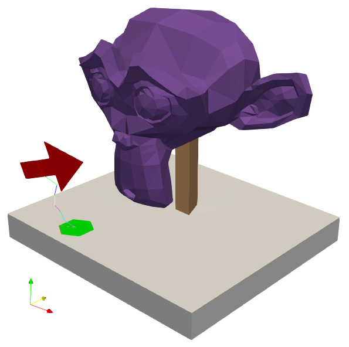

# Suzanne Repository 

This repository contains a small set of test meshs.

## Suzanne.msh

Derived from the famous Suzanne geometry object, this MSH file consists of TET10-elements (e.g. head and base), TRI6-elements (e.g. the sign), and EDGE3-elements (e.g. the sign pole).

