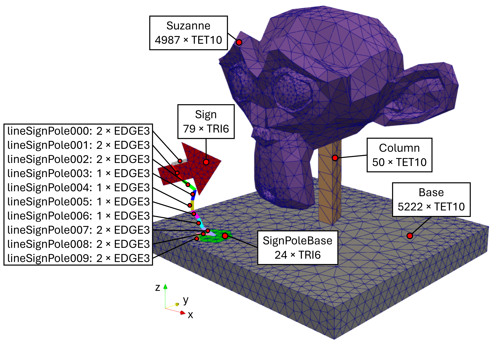
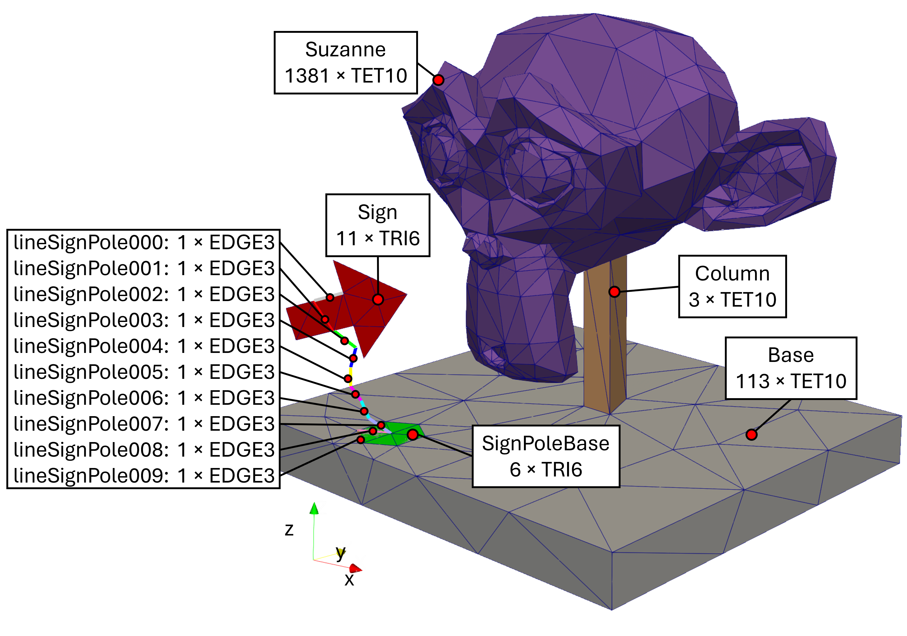

# Suzanne MSH 

This repository contains an [Gmesh](https://gmsh.info/) MSH file for testing.

Derived from the famous Suzanne geometry object of [Blender](https://www.blender.org/), this MSH file consists of TET10-elements (e.g. head and base), TRI6-elements (e.g. the sign), and EDGE3-elements (e.g. the sign pole).

## The geometry of suzanne.msh

## Block names and elements 

### Variant with denser discretisation (19'808 nodes)

This variant contains 10'259 TET10 elements. In the image, element count &#215; element type is given.

### Variant with coarser discretisation (3'187 nodes)

With 1'497 TET10 elements, this variant contains significantly fewer elements, but has some badly shaped ones in Susanne's ears.
In the image, element count &#215; element type is given.

