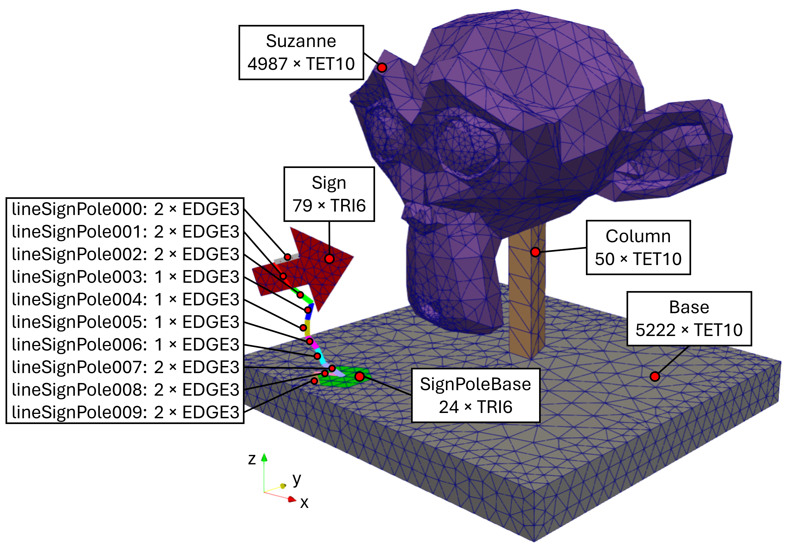

# Suzanne MSH 

This repository contains an [Gmesh](https://gmsh.info/) MSH file for testing.

Derived from the famous Suzanne geometry object of [Blender](https://www.blender.org/), this MSH file consists of TET10-elements (e.g. head and base), TRI6-elements (e.g. the sign), and EDGE3-elements (e.g. the sign pole).

## The geometry of suzanne.msh

## Block names and elements 

In the image, element count &#215; element type is given.

